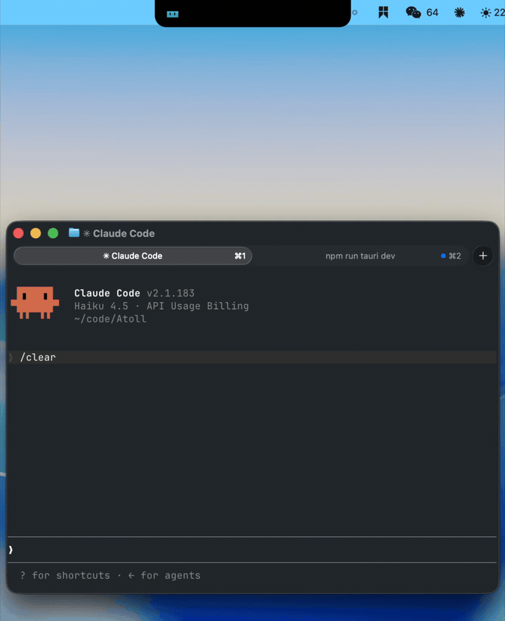
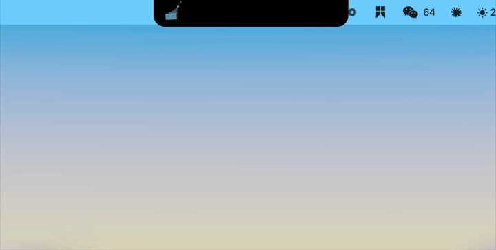
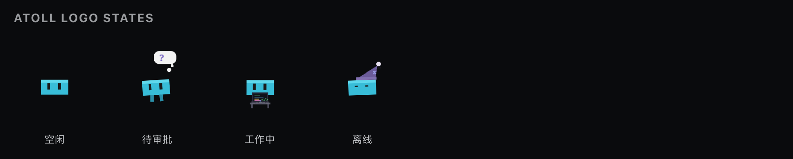
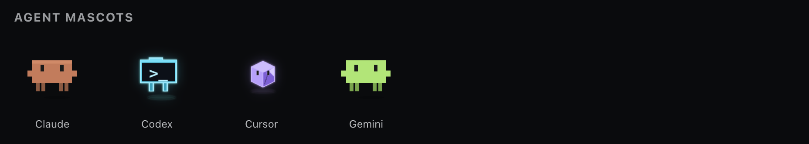
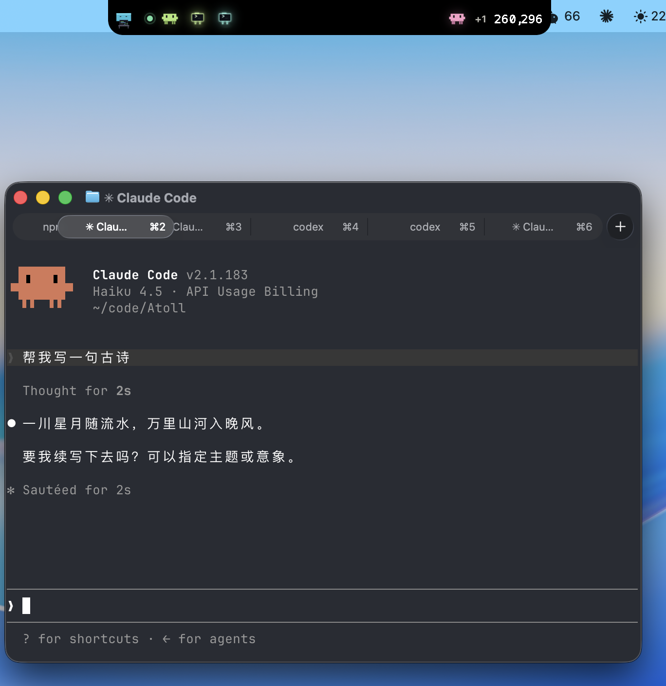

<p align="center">
  
</p>

<h1 align="center">Atoll</h1>

<p align="center">
  <strong>菜单栏 / 顶栏里的 AI 权限审批浮岛</strong><br/>
  <sub>Claude Code / Codex 发起权限请求时，不用切窗口，一眼批准或拒绝</sub>
</p>

<p align="center">
  <a href="https://github.com/sheepbooy/Atoll/releases"></a>
  <a href="https://sheepbooy.github.io/Atoll/"></a>
  
  
  
</p>

<p align="center">
  <a href="https://sheepbooy.github.io/Atoll/">官网</a> ·
  <a href="#安装">安装</a> ·
  <a href="#接入-agent">接入 Agent</a> ·
  <a href="#视觉">视觉</a> ·
  <a href="#开发">开发</a> ·
  <a href="#路线图">路线图</a>
</p>

<br/>

<p align="center">
  
</p>

<p align="center">
  <em>权限请求 → 展开审批 → 置顶 / 归档 → 自动收回</em>
</p>

---

## 是什么

**Atoll** 是一个轻量桌面应用，住在屏幕顶栏（macOS 菜单栏 / Windows 工作区顶部）。完整介绍、动效演示与安装说明见 **[官网](https://sheepbooy.github.io/Atoll/)**。

- **平时** — 紧凑胶囊，显示在线状态、活跃会话、待审批数量
- **有请求时** — 自动展开，展示命令详情，一键 **Approve / Deny / Always**
- **全程本地** — Hook 桥接 `127.0.0.1:47777`，数据不出本机

目前支持 **Claude Code**（CLI 与 Desktop）和 **Codex CLI 与 Desktop**（macOS Apple Silicon 与 Windows x64）。

---

## 安装

### macOS

**推荐 — 一行命令：**

```bash
curl -fsSL https://raw.githubusercontent.com/sheepbooy/Atoll/main/scripts/install.sh | bash
```

指定版本：`ATOLL_VERSION=0.1.4 curl -fsSL .../install.sh | bash`

<details>
<summary>其他 macOS 安装方式</summary>

**Homebrew**

```bash
brew tap sheepbooy/tap
brew install --cask --no-quarantine atoll
```

**手动下载** — 从 [Releases](https://github.com/sheepbooy/Atoll/releases) 下载 `Atoll-aarch64.dmg`，拖入 Applications 后执行：

```bash
sudo xattr -cr /Applications/Atoll.app
```

> 应用尚未公证。首次启动若被拦截，在 Applications 中右键 **Open** 一次即可。

</details>

### Windows

**推荐 — 一行安装**（cmd、PowerShell、Windows 终端均可）：

```cmd
powershell -NoProfile -ExecutionPolicy Bypass -Command "irm https://raw.githubusercontent.com/sheepbooy/Atoll/main/scripts/install.ps1 | iex"
```

> 若在 **命令提示符 (cmd)** 中直接运行 `irm ... | iex` 会报错 `'irm' 不是内部或外部命令`——`irm` / `iex` 是 PowerShell 别名，cmd 无法识别。请使用上面的命令，或先打开 PowerShell 再安装。

已在 PowerShell 中时，可简写为：

```powershell
irm https://raw.githubusercontent.com/sheepbooy/Atoll/main/scripts/install.ps1 | iex
```

指定版本：

```cmd
set ATOLL_VERSION=0.1.11 && powershell -NoProfile -ExecutionPolicy Bypass -Command "irm https://raw.githubusercontent.com/sheepbooy/Atoll/main/scripts/install.ps1 | iex"
```

```powershell
$env:ATOLL_VERSION = "0.1.11"; irm https://raw.githubusercontent.com/sheepbooy/Atoll/main/scripts/install.ps1 | iex
```

**手动下载** — 从 [Releases](https://github.com/sheepbooy/Atoll/releases) 下载 `Atoll-x64.msi` 并安装。

> Windows 安装包（`Atoll-x64.msi`）从 **v0.1.9** 起随 Release 发布；v0.1.8 及更早版本仅含 macOS 产物。
> 首次运行若被 SmartScreen 拦截，选择「更多信息」→「仍要运行」。Hook 安装需要本机已安装 **Node.js** 且在 PATH 中。

---

## 接入 Agent

Atoll 通过应用内 **一键安装 Hook**，无需手动编辑配置文件。

<p align="center">
  
</p>

| Agent | 安装路径 | 额外步骤 |
| --- | --- | --- |
| **Claude Code**（CLI + Desktop） | 菜单 → Settings → Agent hooks → Install | Desktop：权限选 **Ask permissions**，安装后完全退出并重启 Claude Desktop，再在 Code 标签触发一次 Bash 权限验证 |
| **Codex**（CLI + Desktop） | 同上 → Install Codex | Desktop/CLI：安装后在 Codex 中打开 `/hooks` 并信任 Atoll hook，完全退出并重启 Codex Desktop，再触发一次 shell 权限验证 |

Hook 注册 `PermissionRequest`、`PostToolUse`、`Stop` 等事件，写入 `~/.claude/settings.json`（CLI 与 Desktop 共用）或 `~/.codex/hooks.json`。安装时会写入 Node.js 的绝对路径，避免 Desktop 子进程找不到 `node`。

卸载：Settings → Agent hooks → Uninstall（仅移除 Atoll 条目，保留你的其他 hooks）。

> 自定义端口：设置环境变量 `ATOLL_HOOK_URL`，或让 Atoll 写入 `%LOCALAPPDATA%/Atoll/bridge.json`（Hook 脚本会自动读取）。

### 快捷键

| 操作 | 按键 |
| --- | --- |
| Approve | `Enter` |
| Deny | `Delete` |
| Always approve | `Shift` + `Enter` |

---

## 视觉

### Atoll Logo 状态

菜单栏 Logo 反映 App 全局状态（与 Agent 无关）：

<p align="center">
  
</p>

| 状态 | 含义 |
| --- | --- |
| 空闲 | 在线监听，无 session、无 pending |
| 待审批 | 有权限请求等待处理 |
| 工作中 | 有活跃 Agent 会话 |
| 离线 | Hook 未就绪或 bridge 不可达 |

### Agent 形象

每个 Agent 有独立的像素风 mascot；Gemini 复用 Clawd 造型并着色为绿色：

<p align="center">
  
</p>

### 多 Session 与终端

<p align="center">
  
</p>

---

## 开发

```bash
npm install          # 安装依赖
npm run tauri dev    # 启动桌面应用（需 Rust）
npm test             # 运行测试
npm run tauri build  # 打包
```

**Windows 额外要求：** Visual Studio Build Tools（C++ 工作负载）、WebView2 Runtime、Node.js（Hook 脚本）。

**macOS 额外要求：** Xcode Command Line Tools。

<details>
<summary>项目结构 & 文档素材</summary>

```
src/                          React 浮岛 UI
src-tauri/src/hook_bridge.rs  本地 HTTP 桥接（Claude + Codex）
src-tauri/src/transcript.rs   JSONL 会话 & Token 解析
scripts/atoll-*-hook.mjs      Hook shim（随应用分发）
```

重新生成 README 截图（macOS）：

```bash
npm run capture:media    # 浮岛 UI 截图 + demo GIF
npm run export:brand     # Logo 状态 + Agent 形象
```

发布新版本（Git Bash / WSL / macOS）：

```bash
./scripts/release.sh 0.1.11
```

推送 `v*` tag 后会并行构建 macOS DMG 与 Windows MSI，并上传到 GitHub Releases。

</details>

---

## 路线图

- [ ] Apple 签名 & 公证、Intel Mac 构建
- [ ] Windows 代码签名
- [ ] Gemini / Cursor 等更多 Agent 适配
- [ ] 新请求自动展开、通知中心提醒
- [ ] 审批历史导出、会话搜索
- [x] Codex hook 适配

---

## License

MIT

<p align="center">
  <sub>Built for developers who live in the terminal but refuse to context-switch for every <code>y/n</code>.</sub>
</p>
