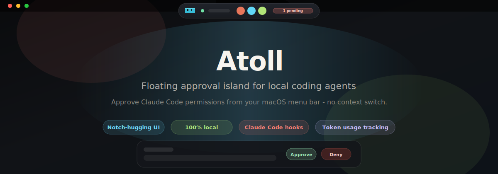
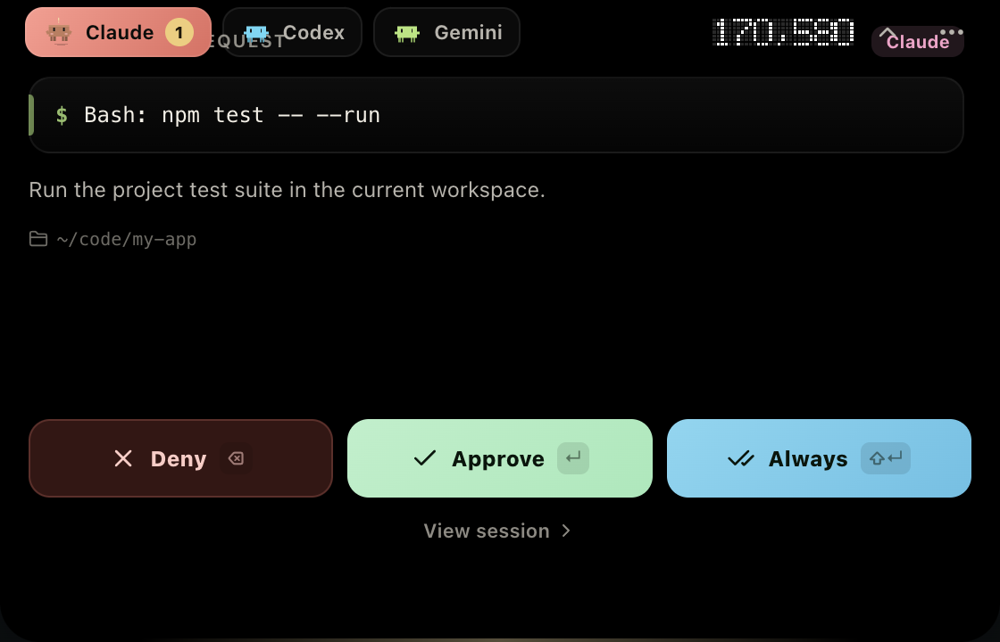
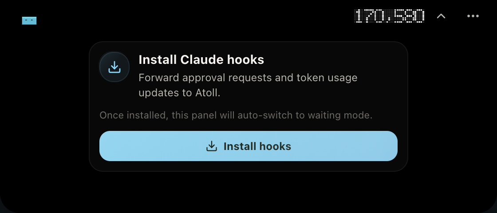
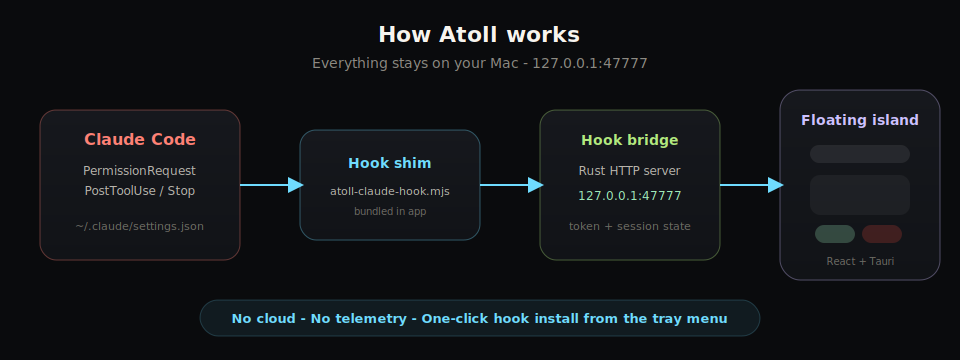
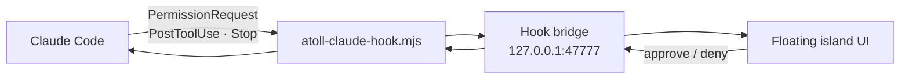

<p align="center">
  
</p>

<h1 align="center">Atoll</h1>

<p align="center">
  <strong>Floating approval island for local coding agents</strong><br/>
  <sub>macOS 菜单栏里的 AI 权限审批浮岛 — 不用切窗口，一眼批准或拒绝</sub>
</p>

<p align="center">
  <a href="https://github.com/sheepbooy/Atoll/releases"></a>
  
  
  
  
</p>

<p align="center">
  <a href="#-demo">Demo</a> ·
  <a href="#-quick-start">Quick Start</a> ·
  <a href="#-what-it-does">What it does</a> ·
  <a href="#-screenshots">Screenshots</a> ·
  <a href="#-todo">TODO</a> ·
  <a href="#-connect-claude-code">Claude Code</a> ·
  <a href="#-development">Development</a>
</p>

<br/>

<p align="center">
  
</p>

<br/>

## 这是什么？

**Atoll** 是一个跑在你 Mac 上的轻量桌面应用。它住在**菜单栏 / 刘海区域**，像 Dynamic Island 一样：

- 平时是一粒紧凑的胶囊，显示在线状态、活跃会话和待审批数量
- 有权限请求时自动展开，展示命令详情
- 你点 **Approve / Deny / Always**，不用回到终端或 IDE

目前专注 **macOS + Claude Code**，通过本地 Hook 桥接（`127.0.0.1:47777`），**数据不出本机**。

> **Status:** Early desktop shell — first release targets the floating island + Claude Code hook bridge.

---

## 🎬 Demo

<p align="center">
  
</p>

<p align="center">
  <em>点击浮岛展开 → 查看命令详情 → 一键 Approve / Deny → 自动收回</em>
</p>

---

## ✨ What it does

<table>
<tr>
<td width="50%" valign="top">

### 🏝️ Notch-hugging island

A pill in the menu bar that expands into a panel when work needs your attention, then collapses when idle.

</td>
<td width="50%" valign="top">

### ⚡ Live permission flow

Claude Code `PermissionRequest` hooks stream into Atoll in real time over a local HTTP bridge.

</td>
</tr>
<tr>
<td width="50%" valign="top">

### 📊 Token usage

Per-session token counters with daily rollups — input, output, and cache stats at a glance.

</td>
<td width="50%" valign="top">

### 🔒 No cloud

Everything runs locally. The hook bridge binds to `127.0.0.1:47777` — nothing leaves your machine.

</td>
</tr>
</table>

---

## 📸 Screenshots

### Menu bar capsule → expanded approval

<p align="center">
  
</p>

<p align="center">
  
</p>

<p align="center">
  <em>Approve with <kbd>Enter</kbd> · Deny with <kbd>Delete</kbd> · Always-approve with <kbd>Shift</kbd>+<kbd>Enter</kbd></em>
</p>

### One-click hook setup

<p align="center">
  
</p>

<p align="center">
  <em>Open the tray menu → <strong>Install hooks</strong> — no manual <code>settings.json</code> editing.</em>
</p>

---

## 🔁 How it works

<p align="center">
  
</p>



| Layer | Role |
| --- | --- |
| `scripts/atoll-claude-hook.mjs` | Hook shim bundled in the app; registered into `~/.claude/settings.json` |
| `src-tauri/src/hook_bridge.rs` | Local HTTP server — receives events, tracks sessions & tokens |
| `src/` | React + TypeScript island UI (compact ↔ expanded transitions) |
| `src-tauri/src/lib.rs` | Rust core — tray menu, window geometry, request state |

---

## 🚀 Quick start

### Option 1 · One-line install *(recommended)*

Downloads the latest release, installs to `/Applications`, and clears quarantine:

```bash
curl -fsSL https://raw.githubusercontent.com/sheepbooy/Atoll/main/scripts/install.sh | bash
```

Pin a version:

```bash
ATOLL_VERSION=0.1.2 curl -fsSL https://raw.githubusercontent.com/sheepbooy/Atoll/main/scripts/install.sh | bash
```

> If macOS blocks the first launch, right-click **Atoll** in Applications → **Open** once.

### Option 2 · Homebrew

```bash
brew tap sheepbooy/tap
brew install --cask --no-quarantine atoll
```

Upgrade later:

```bash
brew upgrade --cask --no-quarantine atoll
```

### Option 3 · Manual `.dmg`

1. Download `Atoll-aarch64.dmg` from [Releases](https://github.com/sheepbooy/Atoll/releases)
2. Drag **Atoll.app** into **Applications**
3. Clear quarantine:

```bash
sudo xattr -cr /Applications/Atoll.app
```

Or run `Fix-Atoll.command` from the release page.

> Atoll is not notarized yet (no Apple Developer account). Browser-downloaded builds may show "damaged" or "unverified developer" warnings — the steps above fix that.

---

## 🔌 Connect Claude Code

Atoll listens on **`127.0.0.1:47777`** and ships a **one-click hook installer**.

| Step | Action |
| --- | --- |
| 1 | Open Atoll → click the tray / island menu |
| 2 | Click **Install hooks** |

Atoll writes into `~/.claude/settings.json`, pointing at the bundled hook shim:

```
node <app-bundle>/…/atoll-claude-hook.mjs
```

Registered hooks: `PermissionRequest`, `PostToolUse`, `Stop`, `SubagentStop` — so requests from **any** Claude Code working directory reach the island in real time.

To disconnect: same menu → **Uninstall hooks**.

> Override the bridge URL with `ATOLL_HOOK_URL` if you change the port.

---

## 🛠 Development

```bash
npm install          # install deps
npm run dev          # frontend preview (browser)
npm run tauri dev    # desktop app (requires Rust)
npm test             # run tests
npm run tauri build  # production bundle
```

### Project layout

```
src/                          React + TypeScript island UI
  App.tsx                     presentation & layout
  tauri.ts                    frontend ↔ Tauri bridge
  TokenCounter.tsx            per-session token display
src-tauri/src/lib.rs          tray, window geometry, request state
src-tauri/src/hook_bridge.rs  Claude Code hook bridge (HTTP)
scripts/atoll-claude-hook.mjs hook shim (bundled + auto-installed)
```

Future agent adapters should publish events into the Rust core — not couple UI directly to a specific CLI.

### README preview mode

Run the UI in a browser with seeded demo data (for docs / screenshots):

```
http://127.0.0.1:1420/?demo=compact
http://127.0.0.1:1420/?demo=approval
http://127.0.0.1:1420/?demo=idle
```

Regenerate the README demo GIF (requires `npm run dev` in another terminal):

```bash
npm run capture:gif
```

---

## 📦 Releases

Built automatically by GitHub Actions — version comes from the release tag, no manual multi-file bumps needed.

**One-command release** (from `main`, requires [GitHub CLI](https://cli.github.com)):

```bash
./scripts/release.sh 0.2.0
```

**Tag only** (if version files on `main` are already correct):

```bash
git tag v0.2.0 && git push origin v0.2.0
```

Each release ships:

| Artifact | Description |
| --- | --- |
| `Atoll-aarch64.dmg` | Apple Silicon (M1–M4) |
| `Atoll-aarch64.dmg.sha256` | Checksum |
| `install.sh` | One-line installer |
| `Fix-Atoll.command` | Quarantine repair script |

Intel (`x86_64`) builds are not published yet. See [Releases](https://github.com/sheepbooy/Atoll/releases).

---

## 📋 TODO

当前已知缺口与路线图（欢迎 PR）：

### Distribution & trust
- [ ] Apple Developer ID signing & notarization（免 quarantine / 右键 Open）
- [ ] Intel (`x86_64`) release builds
- [ ] Add `LICENSE` file to the repository

### Agent integrations
- [ ] Codex hook adapter（UI 已预留 agent tab，桥接待接入）
- [ ] Gemini hook adapter
- [ ] Cursor / OpenCode / 其他本地 agent 通用事件协议
- [ ] 自动检测未安装的 hook 并在托盘提醒

### Island UX
- [ ] 新权限到达时自动展开（可配置）
- [ ] macOS 通知中心提醒（后台时也不漏审批）
- [ ] 会话列表搜索 / 过滤
- [ ] 审批历史导出

### Developer experience
- [ ] `npm run capture:gif` 纳入 release 前文档检查
- [ ] 端到端测试（Tauri + hook bridge）
- [ ] 公开设计 token / 组件 Storybook

---

## 📄 License

MIT

---

<p align="center">
  
  <br/>
  <sub>Built for developers who live in the terminal but refuse to context-switch for every <code>y/n</code>.</sub>
</p>
